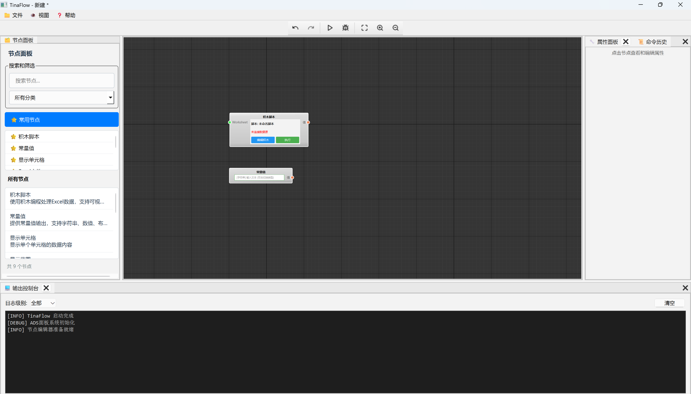
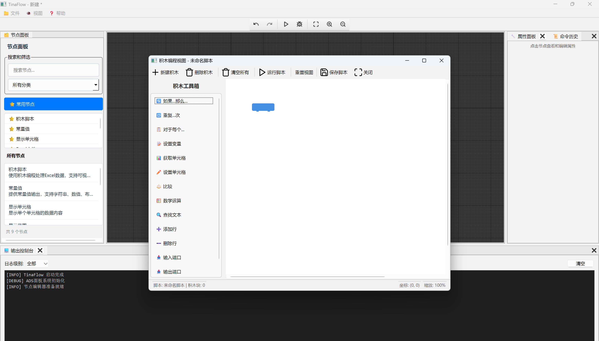

# TinaFlow

TinaFlow 是一个基于 Qt 的可视化流程编辑器，旨在提供直观的节点编程和数据流处理功能。

## 项目截图





## 技术栈

### 核心框架
- **Qt 6.9.1** - 主要 GUI 框架
- **C++17** - 编程语言标准
- **CMake** - 构建系统

### 图形渲染
- **bgfx** - 跨平台图形渲染库
- **OpenGL** - 图形 API 后端
- **自定义着色器** - 用于积木编程的圆角渲染

### UI 组件
- **Qt Advanced Docking System (ADS)** - 高级停靠窗口系统
- **自定义节点编辑器** - 基于 Qt Graphics Framework
- **现代化工具栏** - 自定义 UI 组件

### 数据处理
- **OpenXLSX** - Excel 文件读写支持
- **自定义数据验证器** - 数据类型验证和转换
- **命令模式** - 支持撤销/重做操作

### 架构特性
- **模块化设计** - 清晰的组件分离
- **插件架构** - 可扩展的节点系统
- **错误处理** - 完善的异常处理机制
- **性能分析** - 内置性能监控工具

## 主要功能

### 已实现功能
- ✅ **节点编辑器** - 支持拖拽创建和连接节点
- ✅ **Excel 数据处理** - 读取、写入和显示 Excel 文件
- ✅ **停靠窗口系统** - 灵活的界面布局
- ✅ **命令系统** - 完整的撤销/重做支持
- ✅ **数据验证** - 智能的数据类型检查
- ✅ **现代化 UI** - 美观的用户界面设计

### 开发中功能
- 🚧 **积木编程界面** - 基于 bgfx 的可视化积木编程
- 🚧 **脚本执行引擎** - 将积木转换为可执行代码
- 🚧 **更多节点类型** - 扩展节点库

### 计划功能
- 📋 **插件系统** - 支持第三方节点扩展
- 📋 **云端同步** - 项目文件云端存储
- 📋 **协作编辑** - 多人实时协作功能

## 技术挑战与解决方案

### bgfx 集成挑战
在开发积木编程界面时，我们遇到了以下技术挑战：

1. **坐标系统不一致**
   - 问题：Qt 坐标系（左上原点，+Y向下）与 bgfx 默认坐标系不匹配
   - 解决：自定义投影矩阵，统一坐标系统

2. **鼠标交互精度**
   - 问题：屏幕坐标到世界坐标转换不准确
   - 解决：重新设计变换矩阵和坐标转换算法

3. **渲染性能优化**
   - 问题：大量积木时渲染性能下降
   - 解决：实现几何体缓存和批量渲染

4. **着色器兼容性**
   - 问题：不同平台的着色器编译差异
   - 解决：使用 bgfx 的着色器编译工具链

## 构建说明

### 环境要求
- Windows 10/11 或 Linux
- Visual Studio 2019+ 或 GCC 9+
- Qt 6.9.1+
- CMake 3.20+

### 构建步骤
```bash
# 克隆项目
git clone [repository-url]
cd TinaFlow

# 创建构建目录
mkdir build
cd build

# 配置项目
cmake .. -DCMAKE_BUILD_TYPE=Release

# 编译项目
cmake --build . --config Release

# 运行程序
./bin/TinaFlow
```

### 依赖库
项目使用 Git 子模块管理第三方依赖：
- `third_party/bgfx.cmake` - bgfx 图形库
- `third_party/Qt-Advanced-Docking-System` - ADS 停靠系统
- `third_party/OpenXLSX` - Excel 文件处理
- `third_party/nodeeditor` - 节点编辑器基础

## 项目结构

```
TinaFlow/
├── include/           # 头文件
│   ├── model/        # 数据模型
│   └── widget/       # UI 组件
├── src/              # 源代码
│   ├── model/        # 数据模型实现
│   └── widget/       # UI 组件实现
├── resources/        # 资源文件
│   ├── icons/        # 图标资源
│   └── shaders/      # 着色器文件
├── third_party/      # 第三方库
├── docs/             # 文档
└── image/            # 项目截图
```

## 开发状态

当前项目处于积极开发阶段，核心的节点编辑和数据处理功能已经稳定。积木编程界面正在开发中，遇到了一些 bgfx 集成的技术挑战，我们正在逐步解决这些问题。

## 贡献指南

欢迎提交 Issue 和 Pull Request！请确保：
1. 代码符合项目的编码规范
2. 添加适当的测试用例
3. 更新相关文档

## 许可证

本项目采用 MIT 许可证 - 详见 [LICENSE](LICENSE) 文件。

## 联系方式

- 邮箱：3344207732@qq.com
- QQ群：876680171

---

*TinaFlow - 让数据流动更简单* 🚀
